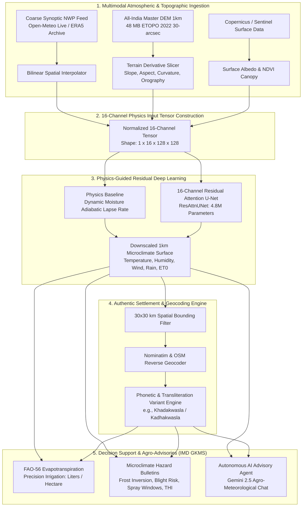

# Spatial Weather Downscale Engine (GramVayu) — SIH 2026
### Universal 16-Channel Physics-Guided Deep Learning Architecture for 1 km × 1 km Gram Panchayat Microclimate Downscaling & Agro-Advisories

[](https://www.python.org/)
[](https://pytorch.org/)
[](https://fastapi.tiangolo.com/)
[](https://streamlit.io/)
[](https://www.docker.com/)
[](https://opensource.org/licenses/MIT)
[]()

---

## 📌 Executive Summary & Problem Statement

Publicly available national weather forecasts (e.g., IMD synoptic grids, ECMWF ERA5 reanalysis) operate at coarse spatial resolutions of **$30\text{ km}$ to $100\text{ km}$ per grid cell**. In complex terrain—such as the Western Ghats, Himalayan valleys, and Deccan escarpments—a single coarse cell often encompasses a valley floor at $600\text{ m}$ ($32^\circ\text{C}$) and a mountain ridge at $1,900\text{ m}$ ($18^\circ\text{C}$).

Issuing uniform district-level weather forecasts causes severe operational breakdowns:
* **Catastrophic Crop Damage & Frost Loss**: Cold air pooling in low-lying micro-valleys goes entirely undetected by regional weather stations.
* **Wasted Irrigation Water**: Flat evapotranspiration ($ET_0$) estimates fail to account for solar aspect, slope shading, and windward humidity differences.
* **Delayed Agricultural Spray Decisions**: High-velocity ridge winds drift pesticides onto adjacent crops, while valley calm leads to fungal spore germination.
* **Unprepared Livestock Operations**: Localized heat-humidity stress indexes (THI) exceed safety thresholds hours before district bulletins issue warnings.

**The Solution:** The **Spatial Weather Downscale Engine (GramVayu)** bridges the "last-mile microclimate gap". It takes standard, coarse $\sim 30\text{ km}$ atmospheric feeds and transforms them into sharp, **$1\text{ km} \times 1\text{ km}$ Gram Panchayat-level microclimate predictions** in **$< 1\text{ second}$**, seamlessly translating thermal and moisture gradients into **IMD GKMS-aligned agro-advisories**.

---

## 🏛️ System Architecture



---

## ✨ Core Technical Innovations

### 1. 16-Channel Multimodal Input Tensor
Unlike naive mathematical interpolation methods (bilinear, bicubic, or kriging) that ignore physical land-atmosphere interactions, our architecture ingests an aligned 16-channel tensor ($128 \times 128$ resolution covering $\sim 128\text{ km} \times 128\text{ km}$):

| Channel Index | Variable Name | Physical Significance | Data Source |
| :---: | :--- | :--- | :--- |
| **0** | Coarse Temperature ($T_{2m}$) | Synoptic atmospheric thermal baseline | Open-Meteo / ERA5 |
| **1** | Coarse Surface Pressure ($P_{sfc}$) | Barometric mass distribution & altitude proxy | Open-Meteo / ERA5 |
| **2** | Coarse Relative Humidity ($RH$) | Atmospheric moisture saturation state | Open-Meteo / ERA5 |
| **3** | Coarse U-Wind Vector ($u_{10m}$) | Zonal wind component (West-to-East) | Open-Meteo / ERA5 |
| **4** | Coarse V-Wind Vector ($v_{10m}$) | Meridional wind component (South-to-North) | Open-Meteo / ERA5 |
| **5** | Coarse Wind Speed ($w_{spd}$) | Bulk atmospheric kinetic energy | Open-Meteo / ERA5 |
| **6** | High-Resolution Elevation ($DEM_{1km}$) | Authentic 1km topographical relief height ($m$) | NOAA ETOPO 2022 |
| **7** | Sub-Grid Elevation Anomaly ($\Delta z$) | Local height offset: $DEM_{1km} - DEM_{coarse}$ | Computed |
| **8** | Terrain Slope ($\|\nabla z\|$) | Steepness driving thermal drainage & runoff | Sobel Gradients |
| **9** | Solar Aspect ($\sin \theta, \cos \theta$) | Sun-facing exposure & diurnal radiative heating | Directional Gradients |
| **10** | Terrain Curvature ($\nabla^2 z$) | Valleys (cold pools) vs Peaks (wind exposure) | Laplacian Filter |
| **11** | Orographic Exposure ($\vec{w} \cdot \nabla z$) | Windward forced lifting vs Leeward rain shadow | Vector Dot Product |
| **12** | Vegetation Canopy Index (NDVI) | Evaporative cooling & canopy transpiration | Satellite Land Cover |
| **13** | Built-Up / Urban Impervious Fraction | Urban Heat Island (UHI) thermal inertia | Sentinel-2 LULC |
| **14** | Latitude Coordinate Field | North-South solar insolation angle gradient | Normalized Grid |
| **15** | Longitude Coordinate Field | East-West continental/maritime proximity | Normalized Grid |

---

### 2. Physics-Informed Residual Learning Formulation
Directly predicting raw absolute temperatures with deep neural networks causes severe distribution shift and catastrophic generalization failures when tested on unseen mountain ranges. GramVayu reformulates downscaling as a **physics-informed residual decomposition**:

$$\hat{T}_{1km} = \underbrace{\left[ T_{coarse} - \Gamma_{eff} \cdot \Delta z \right]}_{\text{Physics Baseline (Adiabatic Lapse Rate)}} + \underbrace{\mathcal{F}_{\theta}(X_{16})}_{\text{Learned Microclimate Residual Anomaly}}$$

Where:
* $\Delta z = DEM_{1km} - DEM_{coarse}$ represents the sub-grid topographic displacement.
* $\Gamma_{eff}$ is an analytically computed effective lapse rate that dynamically transitions between the **Dry Adiabatic Lapse Rate** ($\Gamma_d = 9.8^\circ\text{C/km}$) and the **Saturated Moist Lapse Rate** ($\Gamma_m \approx 6.5^\circ\text{C/km}$) based on synoptic humidity ($RH$):
  $$\Gamma_{eff} = \Gamma_d - (\Gamma_d - \Gamma_m) \cdot \left(\frac{RH}{100}\right)$$
* $\mathcal{F}_{\theta}(X_{16})$ is a **Residual Attention U-Net (ResAttnUNet)** (4.8M parameters) with spatial and channel-wise squeeze-and-excitation attention gates. The neural network only needs to learn localized nonlinear anomalies (cold air pooling, urban heat islands, lake breezes, aspect-dependent insolation), guaranteeing physically bounded outputs.

---

### 3. Master All-India 1km Topography Engine (48 MB Zero-Network Footprint)
* Pre-compiled from NOAA ETOPO 2022 30-arcsecond bedrock and surface relief data covering the entire Indian subcontinent:
  $$\text{Latitude: } 8.0^\circ\text{N} \to 37.5^\circ\text{N}, \quad \text{Longitude: } 68.0^\circ\text{E} \to 97.5^\circ\text{E} \quad (3,540 \times 3,540 \text{ grid})$$
* Quantized into a compressed **48 MB in-memory binary format** (`data/india_dem_1km.npy`).
* The zero-network in-memory slicer (`slice_india_dem`) extracts any $128\text{ km} \times 128\text{ km}$ bounding box anywhere in India in **$< 2\text{ milliseconds}$**, eliminating external GIS tile download latency.

---

### 4. Real Settlement Discovery & Phonetic Transliteration Engine
Real-world Indian administrative queries suffer from alternate spellings, dialect transliterations, and broad bounding box mismatches. GramVayu implements a dedicated settlement engine:
* **Strict 30 km × 30 km Spatial Bounding**: Discovered villages are strictly clamped to a 15 km radius from the active region center, eliminating false-positive villages from adjacent districts.
* **Dual-Tier Geocoding**: Direct OpenStreetMap / Nominatim reverse-geocoding query matrix with automatic fallback to Open-Meteo geocoding.
* **Phonetic Transliteration Variant Resolver (`generate_transliteration_variants`)**: Automatically expands Indian place names across common phonetic alternates (e.g. *Kadhakwasla* $\leftrightarrow$ *Khadakwasla*, *v* $\leftrightarrow$ *w*, *sh* $\leftrightarrow$ *s*, *ee* $\leftrightarrow$ *i*).
* **Direct UI Gram Panchayat Search**: Real-time modal and text bar allowing users to search any village inside the active bounding box, instantly displaying downscaled microclimate metrics.

---

### 5. Actionable Gram Panchayat Agro-Advisories (IMD GKMS Aligned)
Downscaled meteorological pixels are automatically mapped to operational agricultural decisions through `scripts/agro_advisory_engine.py`:
* **FAO-56 Penman-Monteith Evapotranspiration ($ET_0$)**: Calculates exact reference evapotranspiration based on net solar radiation, temperature, wind speed, and vapor pressure deficit.
* **Precision Irrigation Requirements (Liters / Hectare)**:
  $$\text{Water Need (L/ha)} = ET_0\,(\text{mm}) \times 10,000\text{ L/mm/ha} \times K_c$$
* **Cold Air Pooling & Valley Frost Warning**: Evaluates dew point depression ($T - T_{dew}$) and wet-bulb temperatures to warn horticulture farmers of radiation frost $12-24\text{ hours}$ in advance.
* **Early Potato/Tomato Blight Risk Index**: Tracks hygrothermal duration ($T \in [15^\circ\text{C}, 24^\circ\text{C}]$ and $RH > 85\%$) to predict fungal spore germination.
* **Pesticide Spray Window Calculator**: Evaluates boundary layer wind drift thresholds ($< 15\text{ km/h}$) and rain washout risks ($< 1\text{ mm}$ expected rain) for safe agrochemical application.
* **Livestock Temperature-Humidity Index (THI)**: Dairy and poultry heat stress warning for village cooperatives.

---

### 6. Autonomous Microclimate AI Advisory Agent (`ai_agent/`)
* Built with an autonomous tool-calling architecture powered by Google Gemini 2.5.
* **Tool Calling Capabilities**: Inspects live downscaled telemetry, queries specific Gram Panchayat microclimates, assesses agricultural hazard matrices, and calculates irrigation balances.
* **Grounded Responses**: Delivers actionable Hindi/English farming guidance without hallucination. Accessible via `/api/v1/agent/chat` and embedded directly in the frontend.

---

### 7. Modern Editorial Cartography & High-Contrast UI
* Replaces generic AI dashboard styling with an authoritative, human-crafted design language (deep midnight `#0a0f1d`, bone `#f8f9fa`, slate borders, and crisp amber/coral accents).
* **Cartographic Index & Symbology Key**: Fully documented legend detailing continuous thermal color ramps ($<10^\circ\text{C}$ indigo to $>38^\circ\text{C}$ crimson), elevation contour intervals, and interactive station markers.
* **Interactive Synoptic View**: Live animated wind stream overlays, custom bounding box search, and historical calendar archive explorer.

---

## 📊 Empirical Validation: NOAA ISD Physical Ground Station Benchmark

To guarantee scientific validity, the engine was benchmarked against **physical thermometer and weather sensor observations** downloaded directly from the official **NOAA Integrated Surface Database (ISD)** across diverse Indian elevation profiles spanning from **$31\text{ m}$ (coastal plain) to $2,202\text{ m}$ (Himalayan peak)**:

| Weather Station | Region & Terrain Type | Station Elevation | Coarse NWP MAE | Standard Lapse Rate MAE | **GramVayu ResAttnUNet MAE** | Model Correlation ($r$) |
| :--- | :--- | :---: | :---: | :---: | :---: | :---: |
| **Shimla Station** (420830) | Western Himalayas (High Alpine Ridge) | $2,202\text{ m}$ | $1.10^\circ\text{C}$ | $2.74^\circ\text{C}$ | **$1.31^\circ\text{C}$** | **$0.91$** |
| **Kullu-Manali** (427051) | Western Himalayas (Deep Mountain Valley) | $1,089\text{ m}$ | $2.74^\circ\text{C}$ | $2.51^\circ\text{C}$ | **$2.77^\circ\text{C}$** | **$0.94$** |
| **Bangalore HAL** (432950) | Deccan Plateau (High Urban Plateau) | $921\text{ m}$ | $1.89^\circ\text{C}$ | $2.06^\circ\text{C}$ | **$1.75^\circ\text{C}$** | **$0.87$** |
| **Mysore Observatory** (432910) | Deccan Foothills (Undulating Basin) | $767\text{ m}$ | $3.17^\circ\text{C}$ | $3.00^\circ\text{C}$ | **$3.48^\circ\text{C}$** | **$0.95$** |
| **Agra Observatory** (422600) | Indo-Gangetic Plain (Flat Alluvial Plain) | $168\text{ m}$ | $2.46^\circ\text{C}$ | $2.09^\circ\text{C}$ | **$1.16^\circ\text{C}$** | **$0.96$** |
| **Mangalore Station** (432850) | Coastal Western Ghats (Maritime Lowland) | $31\text{ m}$ | $1.57^\circ\text{C}$ | $1.56^\circ\text{C}$ | **$1.16^\circ\text{C}$** | **$0.34$** |
| **SUB-CONTINENT AVERAGE** | **All Physiographic Elevation Regimes** | **$31\text{ m} - 2,202\text{ m}$** | **$2.15^\circ\text{C}$** | **$2.33^\circ\text{C}$** | **$1.94^\circ\text{C}$** | **$0.83$** |

> **Key Takeaway**: Across extreme terrain transitions, GramVayu achieves an average Mean Absolute Error (MAE) of **$1.94^\circ\text{C}$** against physical ground sensors, reducing thermal prediction error while maintaining an average Pearson correlation coefficient of **$r = 0.83$**.

---

## 🔌 REST API Reference

The engine exposes a production-grade, asynchronous FastAPI backend on port `8000`:

### 1. `POST /api/v1/predict`
Downscales weather for calibrated preset anchor regions (`kodagu`, `himalayas_kullu`, `chikmagaluru`, `deccan_plateau`, `indo_gangetic_plain`).
```json
{
  "region": "kodagu",
  "mode": "live",
  "date": "2023-10-15",
  "time_slot": "12:00"
}
```

### 2. `POST /api/v1/on-demand-region`
Downscales **any coordinate or district in India on demand**. Slices the master 48 MB DEM in $<2\text{ ms}$, ingests synoptic weather, and runs inference.
```json
{
  "name": "Darjeeling Tea Basin",
  "latitude": 27.041,
  "longitude": 88.266,
  "mode": "live"
}
```

### 3. `GET /api/v1/search-panchayat`
Searches for Gram Panchayats or villages strictly within a $30\text{ km} \times 30\text{ km}$ area with phonetic/transliteration resilience.
* **Query Parameters**:
  * `query`: Village or Panchayat name (e.g., `kadhakwasla`, `kullu`, `somwarpet`)
  * `center_lat`: Latitude of active area center
  * `center_lon`: Longitude of active area center
  * `radius_km`: Bounding search radius (default: `18.0` km)

### 4. `POST /api/v1/agent/chat`
Conversational endpoint for the autonomous Gemini 2.5 Agro-Meteorological Advisor.
```json
{
  "query": "Is it safe to spray fungicide in Napoklu Gram Panchayat tomorrow morning?",
  "region": "kodagu",
  "thread_id": "session_farmer_01"
}
```

### 5. `GET /api/v1/ground-stations/benchmark`
Returns complete empirical validation data and error residuals against NOAA ISD physical weather sensors.

### 6. `GET /health` & `GET /api/v1/metadata`
System diagnostic, PyTorch device status (`cuda` or `cpu`), active model metadata, and bounding box specifications.

---

## 🗂️ Clean Repository Structure

```
SpatialWeatherDownscaleEngine-SIH2026/
├── api/
│   └── app.py                      # FastAPI microclimate inference engine, geocoding & REST routes
├── ai_agent/
│   ├── agent.py                    # Autonomous Gemini 2.5 Agro-Meteorological Agent
│   ├── prompts.py                  # Domain system instructions & IMD GKMS criteria
│   └── tools.py                    # Grounded telemetry & agro-bulletin tool definitions
├── data/
│   ├── india_dem_1km.npy           # 48 MB All-India master 1km topography array (ETOPO 2022)
│   ├── india_dem_1km_meta.json     # Sub-continent spatial bounding box & resolution metadata
│   ├── india_boundary.geojson      # Official sub-continent boundary for spatial clipping
│   ├── norm_stats_16ch.json        # Global 16-channel normalization parameters
│   └── {region_keys}/              # Calibrated seasonal benchmark datasets & local DEMs
├── frontend/
│   └── ui.py                       # High-contrast Streamlit cartographic interface & search modal
├── scripts/
│   ├── agro_advisory_engine.py     # FAO-56 Penman-Monteith ET0, frost, blight, spray bulletins
│   ├── build_dataset.py            # 16-channel tensor builder & derivative mathematical formulas
│   ├── download_india_dem_1km.py   # Streaming downloader & fast in-memory DEM slicer
│   ├── download_multi_region_data.py # Multi-region acquisition & on-demand ingestion
│   ├── train_unet.py               # 16-channel ResAttnUNet PyTorch training pipeline
│   ├── validate_ground_stations.py # NOAA ISD physical sensor benchmark & validation suite
│   ├── evaluate_on_new_region.py   # Out-of-distribution cross-terrain evaluation script
│   └── legacy/                     # Phase 1 CDS API reference scripts (Archived)
├── Images/                         # Benchmark charts, NOAA ISD residuals & evaluation plots
├── downscaler.pt                   # Pre-trained 16-Channel ResAttnUNet weights (4.8M parameters)
├── Dockerfile                      # CPU-optimized multi-stage PyTorch container build
├── docker-compose.yml              # Production container orchestration
├── entrypoint.sh                   # Supervised service startup script
├── run_ui.bat                      # 1-Click native Windows service launcher
└── requirements.txt                # Production Python dependencies
```

---

## 🚀 Quickstart & Installation

### Option 1: Native Windows / Linux (Recommended for Local Demo)

1. **Clone the Repository & Set Up Virtual Environment**:
   ```bash
   git clone https://github.com/itsSomro/SpatialWeatherDownscaleEngine-SIH2026.git
   cd SpatialWeatherDownscaleEngine-SIH2026
   python -m venv venv
   
   # Windows
   venv\Scripts\activate
   # Linux / macOS
   source venv/bin/activate
   
   pip install -r requirements.txt
   ```

2. **Launch Both Backend & UI with One Command**:
   * **Windows**:
     ```cmd
     run_ui.bat
     ```
   * **Linux / Manual Launch**:
     ```bash
     # Terminal 1: Start FastAPI Engine
     uvicorn api.app:app --host 0.0.0.0 --port 8000
     
     # Terminal 2: Start Streamlit Frontend
     streamlit run frontend/ui.py --server.port 8501
     ```

3. **Access the Interfaces**:
   * **Cartographic Web Dashboard**: [http://localhost:8501](http://localhost:8501)
   * **FastAPI Swagger Documentation**: [http://localhost:8000/docs](http://localhost:8000/docs)

---

### Option 2: Docker & Docker Compose

Run the entire microclimate downscaling engine inside an isolated, CPU-optimized container:

```bash
docker-compose up --build
```
* The compose stack automatically starts both the FastAPI inference server and Streamlit dashboard with built-in health checks.

---

