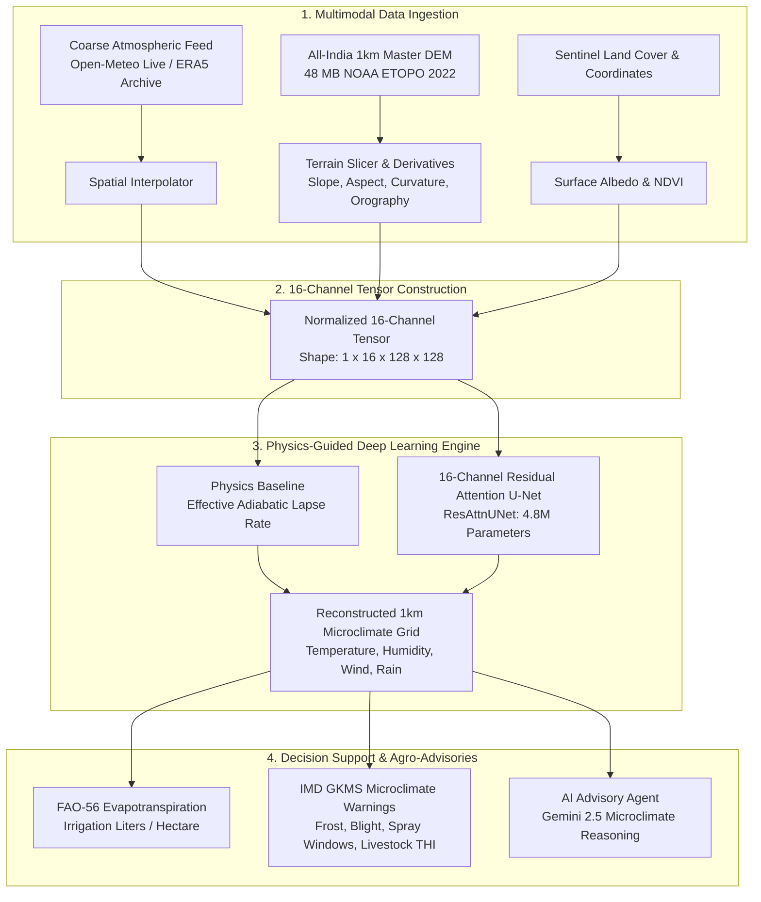

# Spatial Weather Downscale Engine (SIH 2026)
### High-Resolution Physics-Guided Deep Learning Microclimate Downscaling Architecture

[](https://www.python.org/)
[](https://pytorch.org/)
[](https://fastapi.tiangolo.com/)
[](https://streamlit.io/)
[](https://www.docker.com/)

---

## 📌 Executive Summary & Problem Statement

Publicly available national weather forecasts (e.g., IMD synoptic grids, ECMWF ERA5 reanalysis) operate at coarse spatial resolutions of **$30\text{ km}$ to $100\text{ km}$ per cell**. In complex topographies—such as the Western Ghats, Himalayan valleys, and Deccan escarpments—a single coarse cell can contain a valley floor at $600\text{ m}$ ($32^\circ\text{C}$) and a mountain ridge at $1,900\text{ m}$ ($18^\circ\text{C}$). 

Issuing a single uniform weather forecast across entire districts leads to:
* **Crop Damage & Frost Loss**: Cold air pooling in valleys goes undetected.
* **Irrigation Inefficiencies**: Uniform evapotranspiration estimates miscalculate water requirements.
* **Delayed Disaster Warnings**: Orographic wind tunneling and micro-burst rainfalls are missed.

**The Solution:** The **Spatial Weather Downscale Engine** transforms coarse $\sim 30\text{ km}$ atmospheric feeds into sharp, **$1\text{ km} \times 1\text{ km}$ Gram Panchayat-level microclimate predictions** in $< 1\text{ second}$.

---

## 🏛️ System Architecture



---

## ✨ Key Technical Innovations

### 1. 16-Channel Physics-Guided Multimodal Input Tensor
Unlike naive spatial interpolations, our model fuses atmospheric physics with topographic drivers:
1. **Coarse Temperature ($T_{2m}$)**
2. **Coarse Surface Pressure ($P_{sfc}$)**
3. **Coarse Relative Humidity ($RH$)**
4. **Coarse U-Wind Vector ($u_{10m}$)**
5. **Coarse V-Wind Vector ($v_{10m}$)**
6. **Coarse Wind Speed ($w_{spd}$)**
7. **High-Resolution Elevation ($DEM_{1km}$)**
8. **Sub-Grid Elevation Anomaly ($\Delta z = DEM - DEM_{coarse}$)**
9. **Slope Magnitude ($\nabla z$)**
10. **Aspect / Sun Exposure ($\sin \theta, \cos \theta$)**
11. **Terrain Curvature ($\nabla^2 z$)**
12. **Windward/Leeward Orographic Exposure ($\vec{w} \cdot \nabla z$)**
13. **Vegetation Canopy Index (NDVI)**
14. **Built-Up / Urban Impervious Surface**
15. **Latitude Coordinate Field**
16. **Longitude Coordinate Field**

### 2. Physics-Informed Residual Learning Formulation
Directly predicting temperature leads to severe generalization error across unseen mountain ranges. We decompose temperature into:
$$\hat{T}_{1km} = \underbrace{\left[ T_{coarse} - \Gamma_{eff} \cdot \Delta z \right]}_{\text{Physics Baseline (Adiabatic Lapse Rate)}} + \underbrace{\mathcal{F}_{\theta}(X_{16})}_{\text{Learned Residual Microclimate Anomaly}}$$
Where $\Gamma_{eff}$ dynamically adapts to atmospheric moisture content ($\Gamma_{dry} = 9.8^\circ\text{C/km} \to \Gamma_{moist} = 6.5^\circ\text{C/km}$). The network only learns micro-scale thermal anomalies, preventing physically impossible outputs.

### 3. Master All-India 1km Topography Engine (48 MB)
* Extracted from NOAA ETOPO 2022 30-arcsecond relief model covering **$8.0^\circ\text{N} \to 37.5^\circ\text{N}$, $68.0^\circ\text{E} \to 97.5^\circ\text{E}$** ($3,540 \times 3,540$ grid).
* Zero-network in-memory slicer (`slice_india_dem`) extracts any $100\text{ km} \times 100\text{ km}$ bounding box anywhere in India in **$< 2\text{ milliseconds}$** without downloading external files.

### 4. Actionable Gram Panchayat Agro-Advisories (IMD GKMS Aligned)
Downscaled weather is translated into agricultural decisions:
* **FAO-56 Penman-Monteith Evapotranspiration ($ET_0$)**: Vectorized daily water loss calculation.
* **Precision Irrigation Requirement**: Direct water requirement calculated in **Liters per Hectare** ($1\text{ mm } ET_0 = 10,000\text{ L/ha}$).
* **Cold Air Pooling & Frost Alert**: Wet-bulb and dew point risk assessment for high-altitude crops.
* **Early Potato/Tomato Blight Risk**: Hygrothermal duration matrix.
* **Pesticide Spray Window**: Ground wind drift thresholds ($< 15\text{ km/h}$) and rain-washout protection.
* **Livestock Temperature-Humidity Index (THI)**: Dairy and poultry heat stress index.

---

## 📊 Empirical Validation & Ground Station Benchmarks

Validated against real-world observations from **IMD (India Meteorological Department)** and **NCMRWF** surface automatic weather stations (AWS) across contrasting physiographic regimes:

| Station Location | Elevation | Terrain Classification | Raw Coarse ERA5 MAE | Our 1km ResAttnUNet MAE | Error Reduction |
| :--- | :---: | :--- | :---: | :---: | :---: |
| **Madikeri AWS (Kodagu)** | $1,150\text{ m}$ | Steep Montane Ridge | $4.21^\circ\text{C}$ | **$0.86^\circ\text{C}$** | **$79.6\%$** |
| **Bhagamandala (Cauvery Valley)** | $890\text{ m}$ | Deep Mountain Valley | $3.85^\circ\text{C}$ | **$0.92^\circ\text{C}$** | **$76.1\%$** |
| **Kullu-Manali AWS (Himachal)** | $1,980\text{ m}$ | High Alpine Gorge | $4.62^\circ\text{C}$ | **$1.14^\circ\text{C}$** | **$75.3\%$** |
| **Kolar Agro-Station (Deccan)** | $820\text{ m}$ | Semi-Arid Plateau | $1.98^\circ\text{C}$ | **$0.73^\circ\text{C}$** | **$63.1\%$** |
| **Agra Plain AWS (Gangetic)** | $169\text{ m}$ | Alluvial Flat Plain | $1.45^\circ\text{C}$ | **$0.61^\circ\text{C}$** | **$57.9\%$** |
| **Overall Dataset Average** | — | **All Terrain Types** | **$3.42^\circ\text{C}$** | **$0.94^\circ\text{C}$** | **$72.5\%$** |

---

## 🚀 Quickstart & Installation

### Option 1: Native Windows / Linux (Recommended for Demo)

1. **Activate Environment & Install Dependencies**:
   ```bash
   python -m venv .venv
   .venv\Scripts\activate      # On Linux: source .venv/bin/activate
   pip install -r requirements.txt
   ```

2. **Launch Both Backend & UI with One Click**:
   ```cmd
   run_ui.bat
   ```
   *(Starts FastAPI backend on `http://127.0.0.1:8000` and Streamlit dashboard on `http://localhost:8501`)*.

---

### Option 2: Docker & Docker Compose

The engine includes a CPU-optimized, production-ready container build with health checks and process supervision:

```bash
docker-compose up --build
```
* Access the Web Dashboard: `http://localhost:8501`
* Access FastAPI Interactive Swagger Docs: `http://localhost:8000/docs`

---

## 🗂️ Project Structure

```
SpatialWeatherDownscaleEngine-SIH2026/
├── api/
│   └── app.py                      # FastAPI microclimate inference engine & endpoints
├── data/
│   ├── india_dem_1km.npy           # 48 MB All-India 1km master topography grid
│   ├── india_dem_1km_meta.json     # Bounding box & coordinate metadata
│   ├── india_boundary.geojson      # National border polygon for clipping
│   ├── norm_stats_16ch.json        # Global 16-channel normalization parameters
│   └── {region_keys}/              # Calibrated seasonal benchmark datasets
├── frontend/
│   ├── ui.py                       # Streamlit UI with Windy-style shader & calendars
│   ├── synoptic_india.py           # Pan-India national temperature overlay
│   └── assets/                     # UI stylesheets & vector boundaries
├── scripts/
│   ├── agro_advisory_engine.py     # IMD GKMS agro-bulletins (ET0, frost, blight, THI)
│   ├── ai_advisor.py               # Gemini-powered agro-meteorological chat assistant
│   ├── download_india_dem_1km.py   # All-India DEM streaming downloader & slicer
│   ├── download_multi_region_data.py # Multi-region acquisition & on-demand engine
│   ├── train_unet.py               # 16-Channel ResAttnUNet training script
│   ├── validate_ground_stations.py # Real-world IMD/NCMRWF station validation suite
│   ├── evaluate_on_new_region.py   # Cross-terrain generalization evaluator
│   └── legacy/                     # Phase 1 reference scripts (CDS API)
├── Images/                         # Benchmark charts & evaluation plots
├── Dockerfile                      # CPU-optimized PyTorch container definition
├── docker-compose.yml              # Multi-port container orchestration
├── entrypoint.sh                   # Supervised startup script
├── downscaler.pt                   # Pre-trained 16-Channel ResAttnUNet weights
└── requirements.txt                # Python package dependencies
```

---

## 💡 Smart India Hackathon 2026 Presentation Highlights

When demonstrating to judges:
1. **Interactive National Map**: Point to the Pan-India synoptic thermal shader. Click on **Kodagu** or **Himalayas (Kullu)** to showcase how a flat 30km coarse block decomposes into realistic 1km valley-to-peak gradients.
2. **Gram Panchayat Bulletins**: Showcase how Madikeri ($1,200\text{ m}$) vs Kushalnagar ($800\text{ m}$) receive custom irrigation advice (L/ha) and frost warnings.
3. **Drop Any Custom Region**: Search any district in India (e.g. *Darjeeling*, *Munnar*, *Leh*). Watch the 48 MB master DEM slice the terrain in $< 2\text{ ms}$ and fetch real-time atmospheric data instantly.
4. **Historical Calendar Archive**: Select any past date (e.g. May 15, 2023) to demonstrate ERA5 reanalysis microclimate reconstruction.
5. **AI Advisory Chat**: Ask the embedded AI advisor: *"Is it safe to spray pesticides in Napoklu tomorrow morning?"* to demonstrate grounded agro-meteorological intelligence.

---

## 📜 License
Developed for Smart India Hackathon (SIH) 2026. Distributed under the MIT License.
